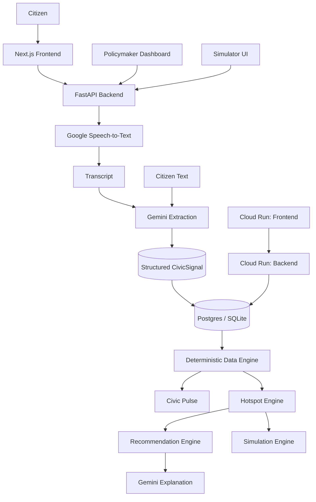

# Architecture

```mermaid
flowchart TD
    Citizen --> Frontend[Next.js Frontend]
    Frontend --> API[FastAPI Backend]
    API --> SpeechToText[Google Speech-to-Text]
    SpeechToText --> Transcript[Transcript]
    Transcript --> Gemini[Gemini Extraction]
    CitizenText[Citizen Text] --> Gemini
    Gemini --> CivicSignal[(Structured CivicSignal)]
    CivicSignal --> Database[(Postgres / SQLite)]
    Database --> DataEngine[Deterministic Data Engine]
    DataEngine --> CivicPulse[Civic Pulse]
    DataEngine --> Hotspots[Hotspot Engine]
    Hotspots --> RecommendationEngine[Recommendation Engine]
    RecommendationEngine --> GeminiExplanation[Gemini Explanation]
    Hotspots --> Simulator[Simulation Engine]
    Dashboard[Policymaker Dashboard] --> API
    SimulatorUI[Simulator UI] --> API
    CloudRunFrontend[Cloud Run: Frontend] --> CloudRunBackend[Cloud Run: Backend]
    CloudRunBackend --> Database
```

Rules: Gemini extracts/explains only (validated output, template fallback).
Python owns every number. Allowlisted filters only — the model never touches SQL.
