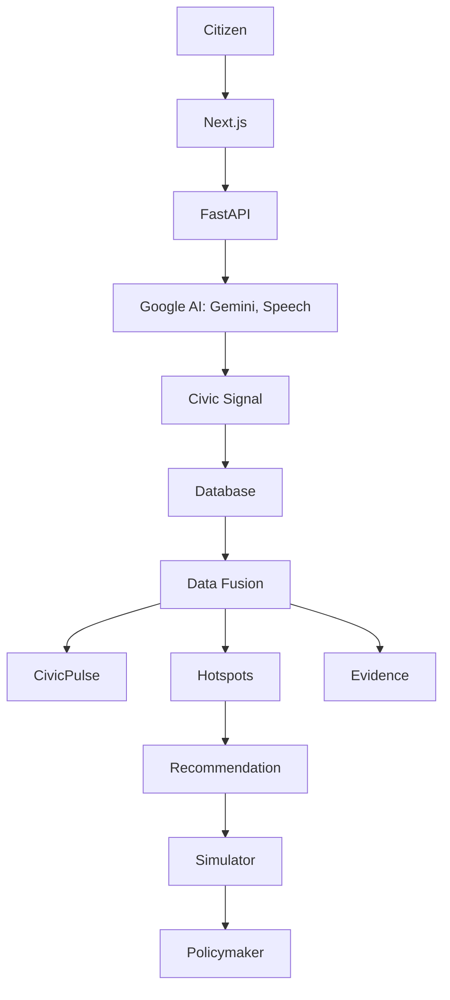

# Architecture

Rules: Gemini extracts/explains only (validated output, template fallback).
Python owns every number. Allowlisted filters only — the model never touches
SQL. Deploy: Cloud Run frontend + backend, Postgres, GCS, Speech-to-Text.
